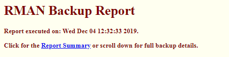
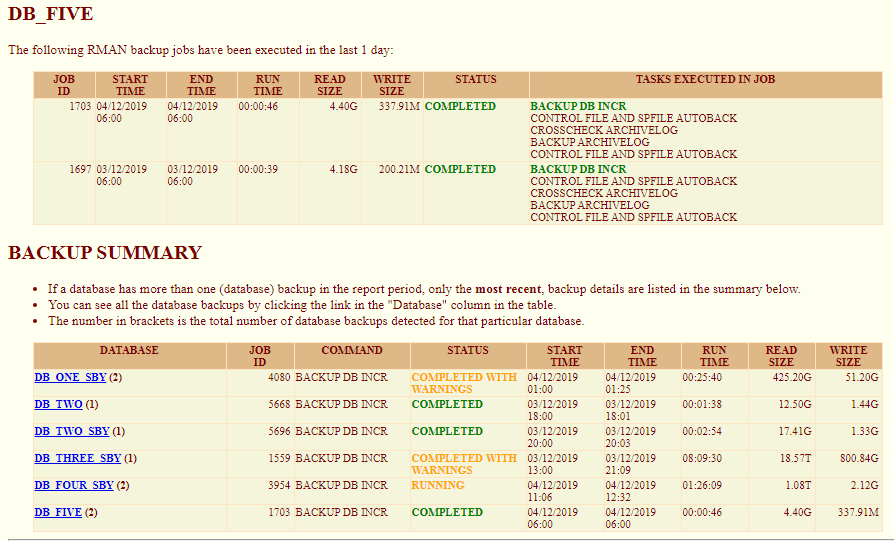

= RMAN Backup Reports - User Guide
Norman Dunbar <norman.dunbar@hermes-europe.co.uk> 
v1.1, 2019-07-03
//v1.0, 2018-04-07  // Original version

:doctype: book
:media: prepress
:toc: left
:toclevel: 4
:icons: font
:!sectnums:
:source-highlighter: coderay

== RMAN Backup Reports

=== Introduction

See the file `SourceCode.pdf` if you want to make changes. This file explains how to use the `rmanBackups` utility.

`RMANBackups.exe` is a utility that will login to a number of databases and create a report detailing all the RMAN jobs that were executed in the past 'n' days, where 'n' is a supplied parameter on the command line. Normally, you would be interested in backups from yesterday, or 1 day ago.

The information retrieved form the database(s) is obtained from the views `V$RMAN_BACKUP_JOB_DETAILS` and `V$RMAN_STATUS` which are, effectively, interrogating the data from the control file for the database.

Any database backup job that did not finish with a status of 'COMPLETED' will be flagged in bold, red text - to attract your attention. Anything running at the moment, or which completed with warnings, will be highlighted in amber text. Green text, indicates a successful backup. 

Sometimes, looking for the actual database backups, in amongst all the archived log backups or deletions etc, can be difficult, so these are highlighted in *bold* (and green) text to make then easy to find.
 
The OEM Repository database is not able store any backup data other than for the most recent one that was run - so a backup consisting of the database, archived logs and the control file auto-backup would only show details of the control file auto-backup and not the other two. (From view 
`MGMT$HA_BACKUP`.) 

=== Execution

==== Setting Your Path

Before executing the utility, you need to have set your path to make sure that the Oracle client's `bin` folder is listed. Within this folder, there will be a file named `oci.dll` and this is required for the operation of the utility. Different versions of Oracle client have different versions of this dll, but the utility should/will work with anything from 11g onwards. (I am reliably informed!)

If you do not have the oci.dll in your path somewhere, you will see the following errors at runtime:

[source,none]
----
Cannot load OCI shared library (oci.dll)Error ORA-00000 detected
Cannot initialise the Oracle Environment.
----

==== Parameters

The utility takes a single parameter, which is the name, or full path, to a parameter file containing  the various logon credentials.

[WARNING]
====
This is currently in plain text and is unencrypted, so be careful about where you store the file. It should not be readable by _undesirables_!
====

The format of each line is as follows:

[source]
----
Username/password@alias[:SYSDBA]?days_ago_to_check
----

The fields are:

* The username to logon to the database as. This is mandatory.
* A slash character, '/'.
* The password for the username. This is mandatory. Wrap the password in double quotes if it has any special or _weird_ characters.
* An _at_ character, '@'.
* The database alias, as per `tnsnames.ora`. This is mandatory.
* If the logon is to be done `as sysdba` then a colon character is required, ':'.
* If the logon is to be done `as sysdba` then the word SYSDBA, letter case is not important.
* A question mark character, '?'.
* A number, representing the number of days that the RMAN output is to be reported upon. This is mandatory.

[NOTE]
====
No spaces are allowed on the parameter line, unless it is part of a password and the password is wrapped in double quotes.
====

For example, to check `orcl12c` for the backups over the last 5 days:

[source]
----
dunbarnorman/topSecret1233@orcl12c?5
----

or, to login as above, but as the sysdba:

[source]
----
dunbarnorman/topSecret1233@orcl12c:SYSDBA?5
----

If you don't have an alias in your `tnsnames.ora` for a particular database, then the normal tns timeout period will eventually pass, and the utility will continue to the next database in the list.

[WARNING]
====
*Pluggable databases*. The login username has to be a _common_ `C##` user and must be created in the container, not the pluggable database. The view `V$RMAN_BACKUP_JOB_DETAILS` cannot be read by any user in a pluggable database, only in the container, hence the need to logon to the container than the pluggable database. Not helpful Oracle! (Pluggable users can, of course, see `V$RMAN_STATUS` - consistent or what?)

To get around this, you must:

* Create a `C##USER` in the _container_, with the appropriate password, and the usual privileges;
* Add an alias to the `TNSNAMES.ORA` file for the _container_ database;
* Configure the backup checker's parameter file with the _container_ database login credentials (and SYSDBA).
====

==== Output File

It is advised to redirect the output to an html file, as shown in the example above, as the program produces HTML output only which is not easy to read on the screen. By redirecting to a file, you can then open the file in a browser (or you could use Internet Explorer!) for easy viewing.

The HTML text for the report is written to 'standard output' while informational and error messages are written to 'standard error'. Both can be redirected as follows:

[source,none]
----
rmanBackups logons.txt >rmanBackups.html 2>rmanBackups.error.log
----

In this case, nothing will be written to the screen, HTML output will be written to `rmanBackups.html` and messages and errors will go to `rmanBackups.error.log`.

==== Report Format

The report includes the following details:

* The job id - created by Oracle for the main session that initiated the RMAN command(s).
* The start time - the time that the first RMAN command began.
* The end time - the time that the last RMAN command finished.
* The run time of the full job, in hh:mm:ss format.
* The input size - the full size of the input files for the entire job.
* The written size - the size written by RMAN to the output file(s). Normally smaller than the input size due to compression etc.
* The job's final status - 'COMPLETED' is good. Other values may not be so good and should be brought to the attention of the German DBAs who are responsible for the backup jobs.
* The tasks executed by the job. This is a list of the various steps that RMAN execute within the job.

From version 1.06 onwards, there is a backup summary (at the end of the report) which lists the details of the _most recent_ database backup (not archived logs, not pfile etc, the database itself) and also, the count of the number of database backups taken in the report period for this particular database. A link in the summary table takes you to the full details for that database, in the main body of the report.

[NOTE]
====
Only databases which have had at least one database backup, as opposed to just Archived logs or parameter/control files etc, will be listed in the summary table.
====

A helpful link at the top of the report takes you directly to the summary as per this image:

An example report can be found in the software repository, it is named `rmanBackups.html`.

You can see the summary table in the above image, as well as a list of backups for a single database. This database backs up everything in one job, other databases will have separate jobs for the database and the archived logs etc.
